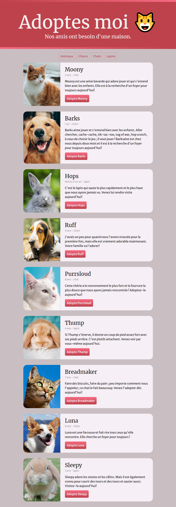

# Pets Adoption
- JavaScript Projet
- Front et Back

- Deployer sur GitHub
- Utiliser Edge ou Firefox

## FRONT
- HTML - CSS - JS
> GitHub : https://github.com/elviredev/pets-adoption

## BACK
- Pages détails d'un animal
- Photos
- pets.json
> GitHub : https://github.com/elviredev/pets-adoption-data

